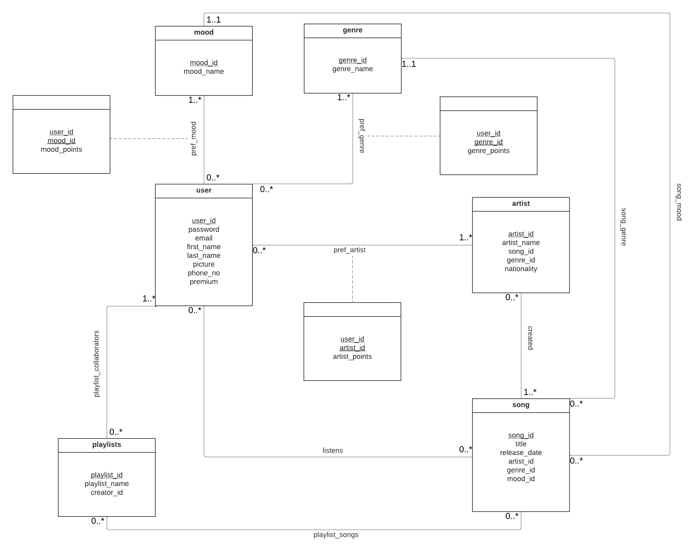

# Database conceptual design

## UML diagram



## Entities
### User
- user_ID: A unique string identifier serving as the primary key, ensuring the distinct identity of each user for authentication and personalized recommendations.
- password: A string attribute securely storing user passwords for authentication purposes.
- email: A string attribute uniquely linking each user's account to their email ID.
- firstname: A string attribute capturing the user's First Name.
- lastname: A string attribute capturing the user's Last Name.
- picture: A BLOB (binary large object) attribute used to store user profile pictures.
- phone_no: An integer attribute providing user contact information via phone number.
- premium: An tinyint attribute indicating whether the user is a premium member, granting access to exclusive features.

Assumptions:
1. User_IDs are unique and immutable, serving as the primary means of authentication and user identification.
2. Users can change their passwords for enhanced security. Additionally, phone_no, picture, and premium attributes can be updated to reflect changing user information.
3. Upon user login, the system automatically identifies the user's role (premium or regular) based on their premium attribute, granting them access to relevant exclusive features.


### Playlist
- playlist_ID: An integer attribute acting as a unique identifier for each playlist, serving as the primary key.
- playlist_name: A string attribute identifying the name of the playlist.
- creator_ID: A string attribute that identifies users who collaborate and contribute songs to the playlist.

Assumptions:
1. By adding the creator_ID we are assuming that multiple users want to collaborate and create a playlist.
2. Playlist names are not necessarily unique, so playlist_ID is used as the definitive identifier.

### Mood
- mood_ID: An integer attribute serving as a unique identifier for different mood types, acting as the primary key.
- mood_name: A string attribute identifying various mood names (e.g., Happy, Sad).

Assumption:
1. Different mood types are uniquely identified by mood_ID, and while similar moods may exist, they have distinct names.


### Genre
- genre_ID: An integer attribute serving as a unique identifier for different genre types, acting as the primary key.
- genre_name: A string attribute identifying various genre names (e.g., Rock, Pop).

Assumption:
1. Unique identification of genre types is achieved through genre_ID, and no two genres share the same name.


### Artist
- artist_ID: An integer attribute serving as a unique identifier for artists, acting as the primary key.
- artist_name: A string attribute identifying the name of the artist.
- song_ID: An integer attribute identifying all songs created by a particular artist.
- genre_ID: An integer attribute identifying the primary genre of music associated with the artist.
- nationality: A string attribute identifying the nationality of the artist.

Assumptions:
1. Each artist is linked to song_IDs, representing songs created by them, assuming that each song belongs to that particular artist. The song can have one or multiple artists that created it
2. Artists are associated with a primary genre (genre_ID), even though they may create music in various genres. This genre_ID will be calculated by considering the maximum count of a particular genre in all the songs created by the artist.


### Song
- song_ID: An integer attribute serving as a unique identifier for songs, acting as the primary key.
- title: A string attribute representing the name of the song.
- release_date: A DATE attribute capturing the release date of the song.
- artist_ID: An integer attribute distinguishing different artists associated with songs.
- genre_ID: An integer attribute distinguishing different genres associated with songs.
- mood_ID: An integer attribute distinguishing different moods associated with songs.

Assumptions:
1. Each song is given a song_ID which is a unique identification of the given song. Since songs can have same titles, we use the ID to uniquely identify the song. 
2. The artist_id is used to link the song to its artist, so we can get additional information on the song which is maintained by using foreign key.Similarly, Each song has one genre associated with it which is linked using genre_id which will give more information about the genre.
3. Additionally, song moods are determined based on factors like loudness and energy, simplifying mood classification. This mood is linked with the song using mood_ID like the genre and the artist.

Some additional assumptions we have made are:
1. The email IDs of each user is uniquely associated with the user ID. This means that the same email ID cannot be used to create multiple accounts and the email ID along with the user ID uniquely identify each user.
2. Due to the above constraint, we can accommodate users with the same first and last name and same phone numbers as well because only the email IDs and user IDs will be unique for each user.
3. We allow multiple playlists to have the same name by associating them with different playlist IDs. The same user can also create multiple playlists with the same name and they would still be considered different due to the playlist IDs.
4. In a similar fashion, we can accommodate multiple songs with the same title by associating them with different song IDs. 

## Relations
We have a total of 9 relationships. They are discussed below:

1. Listens:
- The listens relation joins the user table with the song table to indicate that a song is listened to by the user. It is a **many-to-many** relation as one user can listen to multiple songs and one song can be listened to by multiple users.

2. Created:
- The created relation associates the artist table with the songs table to indicate which artist has produced which song. It is a **many-to-many** relation as multiple artists work together to produce one song, and we can also have multiple songs produced by a single artist.

3. Song mood:
- The song_mood is a relation between the mood and songs. This is a **many to one** relationship because one mood can have many songs( 0 or more)  but each song can only have one mood. 

4. Song genre:
- The song_genre is a relation between the genre and song. This is a **many to one** relationship because one genre can have many songs ( 0 or more)  but one song can have only one genre. 


5. Preferred genre:
- pref_genre is a relationship between User and Genre which will be used to understand the preference of the user towards a particular genre. This relationship will also have an added attribute which is called the genre_points which is used to count the preference of the user. In our tinder-like app, if a user dislikes a song with a genre, lets say “pop”, then pop will get -1 when triggered and +1 for a like and so on. We will have a threshold and according to that we will recommend songs. Let’s say if hip-hop has 5 points then we will recommend hip-hop songs. 
This relationship will be a **many to many** relationship where each user can have 1 or more preferred genres and each genre can have 0 or more users that prefer it. 


6. Preferred mood:
- pref_mood is a relationship between the user and the mood which helps us understand the preference of the user for that particular mood. This relationship also had an added attribute like the pref_genre which is called the mood_points. It works in a similar way to the genre_points. 
This relationship is a **many to many** relationship where each user can have one or more preferred mood whereas each mood has 0 or more users that prefer it.


7. Preferred artist:
- The pref_artist relation joins the artist table with the user table to allow each user to rank their preferred artist using a points attribute. We use this relation to associate each user_ID with an artist_ID and maintain a score representing the number of songs of this artist the user has liked or disliked. Similar to above counts, this also has a artist_points attribute which shows the count of the preference of the artist.  It is a **many-to-many** relation where each user can have one or more preferred artist whereas each artist has 0 or more users that prefer it.

8. Playlist_songs:
- The playlist_songs relation associates the playlist table with the songs table to define which songs are present in a playlist. We use the playlist_IDs along with the song_IDs to create this relation. It will be a **many-to-many** relation as we can have one song as part of many playlists and one playlist containing multiple songs. We do not show this relation table separately in our UML diagram since it is a many to many relationship with no added attributes. 

9. Playlist_collaborators:
- The playlist_collaborators relation joins the playlist table with the user table indicating the collaborators who work on the same playlist apart from the user who created it. We use this relation to associate the playlist_IDs with the user_IDs of the users who have contributed to a playlist. It is a **many-to-many** relation as we can have multiple users working on multiple playlists that is one user can be collaborators of multiple playlist and one playlist can have multiple users as collaborators. .We do not show this relation table separately in our UML diagram since it is a many to many relationship with no added attributes.

## Normalization
Normalization is the process of refining a database schema such that it does not contain redundant dependencies. There are several ways to perform database schema normalization and two primary normal forms of a schema are Boyce-Codd Normal Form (BCNF) and Third Normal Form (3NF).

BCNF works by ensuring the left side of all dependencies are superkeys, i.e., they can derive every other attribute from their attribute closure. BCNF provides lossless decomposition of the database schema as well as removal of certain kinds of redundancies. However, it is a very stringent condition in that the dependencies need to be broken down to a greater extent to satisfy the condition. Furthermore, BCNF decomposition does not guarantee dependency preservation. This means that on decomposing a schema into BCNF, we may lose some essential dependency information and that is a risk we do not want to take for our project. 

3NF is a more relaxed form of normalization that works by ensuring either the left side is a superkey or the right side of the dependency is a part of a key. This allows for more leniency in decomposing the schema. 3NF also ensures dependency preservation which is not guaranteed in BCNF normalization.

Thus, while both BCNF and 3NF are good ways for normalizing, we chose to go with 3NF normalization for the database schema of our application.

Now we start identifying the functional dependencies or FDs in our schema.

1. User id and profile table: 
We have the information of our users stored in a user details table containing attributes such as user ID, email, password, phone number, first name, last name and profile picture. The user ID is the primary key of the table and determines all the other attribute values in a functional dependency that would have the following form:

user_ID —> email, password, firstname, lastname, phone_no, picture, premium

This FD can be decomposed into the following minimal basis:
To follow the rule which states that all attributes are atomic, we further modifies the Fds as following:
user_ID —> email
user_ID —> password
user_ID —> firstname
user_ID —> lastname
user_ID —> phone_no
user_ID —> picture
user_ID —> premium

This is the most simplified minimal basis that can be created from the dependency and we can observe that we cannot drop any of the dependencies to infer any others. This means that this dependency satisfies the 3NF normalization as user_ID is also a superkey since {user_Id}+ = user_id, email, password, firstname, lastname, phone_no, picture, premium

2. Song information table:
We have the information of the songs and their artists stored in a table with attributes song_ID, title, release_date, genre_ID, mood_ID, nationality artist_ID, country, artist_name,  with the song_ID is the primary key.

The following FDs can be inferred from the schema:

song_ID —> title, release_date, genre_ID, mood_ID, artist_ID
artist_ID —> artist_name, nationality

The minimal basis is as follows:

song_ID —> title
song_ID —> release_date
song_ID —> genre_ID
song_ID —> mood_ID
song_ID —> artist_ID
artist_ID —> artist_name
artist_ID —> nationality

Here, let’s check according to the 3NF rules.  In 3NF, there should be no transitive dependency where a non-prime attribute (not part of the primary key) depends on another non-prime attribute through a prime attribute (part of the primary key). 

In this case, we have the transitive dependency artist_ID —> country and   artist_ID —> artist_name where "nationality" and “artist_name” depends on "artist_ID" through "song_ID" because "artist_ID" is dependent on "song_ID" (song_ID —> artist_ID), and "nationality" and “artist_name”  is dependent on "artist_ID." This is a violation of 3NF.

To bring this schema to 3NF, we split the table into two separate tables: one for songs and another for artists. This way, we remove the transitive dependency and we get the songs table as songs that has song_ID as the primary key and then title, release_date, genre_ID, mood_ID, artist_ID, nationality as the rest of the attributes where artist_ID is the primary key. This gives us two tables which are our 2nd and 3rd entities
2. Song tablesong_ID —> title, release_date, genre_ID, mood_ID, artist_ID

To follow the rule which states that all attributes are atomic, we further modifies the Fds as following: 
song_ID —> title
song_ID —> release_date
song_ID —> genre_ID
song_ID —> mood_ID
song_ID —> artist_ID

This is according to 3NF as song_ID is a superkey where {song_ID}+ = song_ID, title, release_date, genre_ID, mood_ID, artist_ID

Next we create a separate table for the artist :

3. Artist information table:
The information about the artists is stored in its own table with attributes artist_ID, name, song_ID(to reference to the song) , genre_ID and nationality(to use these to create further relations)  with the artist_ID as the primary key. The following FDs can be formulated from these:

artist_ID —>  artist_name, song_ID, genre_ID, nationality

The minimal basis is:

artist_ID —>  artist_name
artist_ID —>  song_ID
artist_ID —> genre_ID
artist_ID —>  nationality

Here, none of the dependencies can be dropped and inferred from the rest, and artist_ID is a superkey since {artist_ID} +=  artist_ID, artist_name, song_ID, genre_ID, nationality. Hence we can see that the dependencies are obeying 3NF normal form.

4. Playlist table 
The information that the playlist table consists of is the playlist_ID, the playlist_name and the creator_ID
Here, the playlist_ID is the primary key that gives the rest of the attributes, so :

playlist_ID -> playlist_name, creator_ID

To follow the rule which states that all attributes are atomic, we further modifies the FDs as following:
playlist_ID —> playlist_name
playlist_ID —> creator_ID

Here, none of the dependencies can be dropped and inferred from the rest, and playlist_ID is a superkey since {playlist_ID} +=  playlist_ID, playlist_name, creator_ID, Hence we can see that the dependencies are obeying 3NF normal form.


5. Mood table
We have another table detailing the information on the various moods of the songs available in the database through the mood table. The attributes are mood_ID and mood_name of which the ID is the primary key. There is only one FD that can be formulated here as mood_ID —> mood_name and it is clearly in 3NF since the ID is a superkey as {mood_ID}+ = mood_name.

6. Genre table
This table has a similar form to the above mood table with attributes as genre_ID and genre_name. A similar FD can be formed as genre_ID —> genre_name which is also in 3NF.

Thus the final database schema is in 3NF.


## Relational Schema
The database design will be converted into 11 tables.

**1. user**
```
user(
    user_id VARCHAR(255) [PK],
    password VARCHAR(255),
    email VARCHAR(255),
    first_name VARCHAR(255),
    last_name VARCHAR(255),
    picture BLOB,
    phone_number INT,
    premium TINYINT
)
```

**2. song**
```
song(
    song_id INT [PK],
    title VARCHAR(255),
    release_date DATETIME
    artist_id INT [FK to artist.artist_id],
    genre_id INT [FK to genre.genre_id],
    mood_id INT [FK to mood.mood_id]
)
```

**3. artist**
```
artist(
    artist_Id INT [PK],
    artist_name VARCHAR(255),
    song_id INT [FK to song.song_id]
    genre_id INT [FK to genre.genre_id]
    nationality VARCHAR(255)
)
```

**4. playlists** 
```
playlists(
    playlist_id INT [PK],
    playlist_name VARCHAR(255),
    creator_id VARCHAR(255) [FK to user.user_id] 
)
```

**5. genre**
```
genre(
    genre_id INT [PK],
    genre_name VARCHAR(255)
)
```

**6. mood**
```
mood(
    mood_id INT [PK],
    mood_name VARCHAR(255)
)
```

**7. pref_mood**
```
pref_mood(
    user_id VARCHAR(255) [PK] [FK to user.user_id],
    mood_id INT [PK] [FK to mood.mood_id],
    mood_points INT
)
```

**8. pref_genre**
```
pref_genre(
    user_id VARCHAR(255) [PK] [FK to user.user_id],
    genre_id INT [PK] [FK to genre.genre_id],
    genre_points INT
)
```

**9. pref_artist**
```
pref_artist(
    user_id VARCHAR(255) [PK] [FK to user.user_id],
    artist_id INT [PK] [FK to mood.mood_id],
    artist_points INT
)
```

**10. playlist_songs**
```
playlist_songs(
    playlist_id INT [PK] [FK to playlist.playlist_id],
    song_id INT [PK] [FK to song.song_id]
)
```

**11. playlist_collaborators**
```
playlist_collaborators(
    playlist_id INT [PK] [FK to playlist.playlist_id],
    user_id VARCHAR(255) [PK] [FK to user.user_id]
)
```

**12. listens**
```
listens(
    user_id VARCHAR(255) [PK] [FK to user.user_id]
    song_id INT [PK] [FK to song.song_id]
)
```
