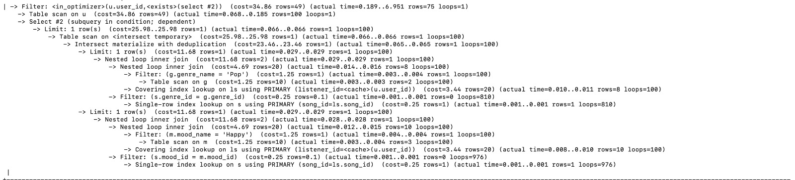

# Database Implementation and Indexing

## Database DDL Commands

```mysql

CREATE DATABASE `BeatMetrics`

USE `BeatMetrics`

DROP TABLE IF EXISTS `Artist`;
CREATE TABLE `Artist` (
  `artist_id` int NOT NULL AUTO_INCREMENT,
  `artist_name` varchar(255) NOT NULL,
  `nationality` varchar(255) NOT NULL,
  `genre_id` int NOT NULL,
  PRIMARY KEY (`artist_id`),
  KEY `genre_id` (`genre_id`),
  CONSTRAINT `Artist_ibfk_1` FOREIGN KEY (`genre_id`) REFERENCES `Genre` (`genre_id`)
);

DROP TABLE IF EXISTS `Genre`;
CREATE TABLE `Genre` (
  `genre_id` int NOT NULL AUTO_INCREMENT,
  `genre_name` varchar(255) NOT NULL,
  PRIMARY KEY (`genre_id`)
);

DROP TABLE IF EXISTS `Listens`;
CREATE TABLE `Listens` (
  `listener_id` varchar(255) NOT NULL,
  `song_id` int NOT NULL,
  PRIMARY KEY (`listener_id`,`song_id`),
  KEY `song_id` (`song_id`),
  CONSTRAINT `Listens_ibfk_1` FOREIGN KEY (`listener_id`) REFERENCES `User` (`user_id`) ON DELETE CASCADE,
  CONSTRAINT `Listens_ibfk_2` FOREIGN KEY (`song_id`) REFERENCES `Song` (`song_id`) ON DELETE CASCADE
);

DROP TABLE IF EXISTS `Mood`;
CREATE TABLE `Mood` (
  `mood_id` int NOT NULL AUTO_INCREMENT,
  `mood_name` varchar(255) NOT NULL,
  PRIMARY KEY (`mood_id`)
);

DROP TABLE IF EXISTS `Playlist`;
CREATE TABLE `Playlist` (
  `playlist_id` int NOT NULL AUTO_INCREMENT,
  `playlist_name` varchar(255) NOT NULL,
  `creator_id` varchar(255) NOT NULL,
  PRIMARY KEY (`playlist_id`),
  KEY `creator_id` (`creator_id`),
  CONSTRAINT `Playlist_ibfk_1` FOREIGN KEY (`creator_id`) REFERENCES `User` (`user_id`) ON DELETE CASCADE
);

DROP TABLE IF EXISTS `Playlist_Collaborators`;
CREATE TABLE `Playlist_Collaborators` (
  `playlist_id` int NOT NULL,
  `collaborator_id` varchar(255) NOT NULL,
  PRIMARY KEY (`playlist_id`,`collaborator_id`),
  KEY `collaborator_id` (`collaborator_id`),
  CONSTRAINT `Playlist_Collaborators_ibfk_1` FOREIGN KEY (`playlist_id`) REFERENCES `Playlist` (`playlist_id`) ON DELETE CASCADE,
  CONSTRAINT `Playlist_Collaborators_ibfk_2` FOREIGN KEY (`collaborator_id`) REFERENCES `User` (`user_id`) ON DELETE CASCADE
);

DROP TABLE IF EXISTS `Playlist_Songs`;
CREATE TABLE `Playlist_Songs` (
  `playlist_id` int NOT NULL,
  `song_id` int NOT NULL,
  PRIMARY KEY (`playlist_id`,`song_id`),
  KEY `song_id` (`song_id`),
  CONSTRAINT `Playlist_Songs_ibfk_1` FOREIGN KEY (`playlist_id`) REFERENCES `Playlist` (`playlist_id`) ON DELETE CASCADE,
  CONSTRAINT `Playlist_Songs_ibfk_2` FOREIGN KEY (`song_id`) REFERENCES `Song` (`song_id`) ON DELETE CASCADE
);

DROP TABLE IF EXISTS `Pref_Artist`;
CREATE TABLE `Pref_Artist` (
  `user_id` varchar(255) NOT NULL,
  `artist_id` int NOT NULL,
  `artist_points` int NOT NULL,
  PRIMARY KEY (`user_id`,`artist_id`),
  KEY `artist_id` (`artist_id`),
  CONSTRAINT `Pref_Artist_ibfk_1` FOREIGN KEY (`user_id`) REFERENCES `User` (`user_id`) ON DELETE CASCADE,
  CONSTRAINT `Pref_Artist_ibfk_2` FOREIGN KEY (`artist_id`) REFERENCES `Artist` (`artist_id`) ON DELETE CASCADE
);

DROP TABLE IF EXISTS `Pref_Genre`;
CREATE TABLE `Pref_Genre` (
  `user_id` varchar(255) NOT NULL,
  `genre_id` int NOT NULL,
  `genre_points` int NOT NULL,
  PRIMARY KEY (`user_id`,`genre_id`),
  KEY `genre_id` (`genre_id`),
  CONSTRAINT `Pref_Genre_ibfk_1` FOREIGN KEY (`user_id`) REFERENCES `User` (`user_id`) ON DELETE CASCADE,
  CONSTRAINT `Pref_Genre_ibfk_2` FOREIGN KEY (`genre_id`) REFERENCES `Genre` (`genre_id`) ON DELETE CASCADE
);

DROP TABLE IF EXISTS `Pref_Mood`;
CREATE TABLE `Pref_Mood` (
  `user_id` varchar(255) NOT NULL,
  `mood_id` int NOT NULL,
  `mood_points` int NOT NULL,
  PRIMARY KEY (`user_id`,`mood_id`),
  KEY `mood_id` (`mood_id`),
  CONSTRAINT `Pref_Mood_ibfk_1` FOREIGN KEY (`user_id`) REFERENCES `User` (`user_id`) ON DELETE CASCADE,
  CONSTRAINT `Pref_Mood_ibfk_2` FOREIGN KEY (`mood_id`) REFERENCES `Mood` (`mood_id`) ON DELETE CASCADE
);

DROP TABLE IF EXISTS `Song`;
CREATE TABLE `Song` (
  `song_id` int NOT NULL AUTO_INCREMENT,
  `title` varchar(255) NOT NULL,
  `release_date` datetime NOT NULL,
  `artist_id` int NOT NULL,
  `genre_id` int NOT NULL,
  `mood_id` int NOT NULL,
  PRIMARY KEY (`song_id`),
  KEY `artist_id` (`artist_id`),
  KEY `genre_id` (`genre_id`),
  KEY `mood_id` (`mood_id`),
  CONSTRAINT `Song_ibfk_1` FOREIGN KEY (`artist_id`) REFERENCES `Artist` (`artist_id`) ON DELETE CASCADE,
  CONSTRAINT `Song_ibfk_2` FOREIGN KEY (`genre_id`) REFERENCES `Genre` (`genre_id`) ON DELETE CASCADE,
  CONSTRAINT `Song_ibfk_3` FOREIGN KEY (`mood_id`) REFERENCES `Mood` (`mood_id`) ON DELETE CASCADE
);

DROP TABLE IF EXISTS `User`;
CREATE TABLE `User` (
  `user_id` varchar(255) NOT NULL,
  `password` varchar(255) NOT NULL,
  `email` varchar(255) NOT NULL,
  `first_name` varchar(255) NOT NULL,
  `last_name` varchar(255) DEFAULT NULL,
  `picture` blob,
  `phone_number` varchar(255) DEFAULT NULL,
  `premium` tinyint DEFAULT NULL,
  PRIMARY KEY (`user_id`)
);

```

We implement `BeatMetrics` database on Google GCP. Connection to the database is shown as below.


We use `show tables` command to see tables implemented in the databse.


## Inserting Data

For this stage, we utilised data from the [Spotify Top 200 Songs Dataset](https://www.kaggle.com/datasets/brunoalarcon123/top-200-spotify-songs-dataset) on Kaggle. We populated the data for `Artist` and `Song` from the above dataset. For `Genre` and `Mood` we have inserted 10 random values based on the context. For `Playlist` and `User` table we wrote a script to generate usernames, playlist names and their respective details. For `Pref_Artist`, `Pref_Genre` and `Pref_Mood` tables, we utilised Danceability, Energy, Loudness, Speechiness, Acousticness and Instrumentalness columns from the dataset and combines these metrics to randomly assign user preferences. For the rest of the tables `Listens`, `Playlist_Collaborators` and `Playlist_Songs` we again wrote python scripts to randomize the data from the existing User, Song and Artist data.

For table `Artist`, `Song`, and `Playlist`, we insert over 1000 data tuples. Below is a proof of data volumes inserted into all the tables.


## Advanced SQL Queries

For this stage, we develop two advanced SQL queries and analyze the performances by using different indexings.

### Query 1

This query finds users who have listened to songs in a specific genre and mood. We will use this query to check the trending genres and moods in our application based on the number of users who have tuned into songs belonging to those particular combination of genres and moods.
```mysql

SELECT u.user_id, u.first_name, u.last_name
FROM User u
WHERE u.user_id IN (
    SELECT DISTINCT ls.listener_id
    FROM Listens ls
    JOIN Song s ON ls.song_id = s.song_id
    JOIN Genre g ON s.genre_id = g.genre_id
    WHERE g.genre_name = 'pop'
    INTERSECT
    SELECT DISTINCT ls.listener_id
    FROM Listens ls
    JOIN Song s ON ls.song_id = s.song_id
    JOIN Mood m ON s.mood_id = m.mood_id
    WHERE m.mood_name = 'sad'
) LIMIT 15;

```
The results are as below:


### Query 2

This query lists the total number of users who listened to that artist on our platform. We will show this statistic on every artists page. This stat can be used by the app users to determine if a artist is popular or not based on the number of unique people who listen to the artist.
```mysql

SELECT
    A.artist_name,
    COUNT(DISTINCT L.listener_id) AS user_count
FROM
    Artist A
LEFT JOIN
    Song S ON A.artist_id = S.artist_id
LEFT JOIN
    Listens L ON S.song_id = L.song_id
WHERE
    A.artist_name = 'Taylor Swift'
GROUP BY
    A.artist_name;

```
The results are as below:
<br>


### Query 3

This query recommends songs based on the most listened genre and the most listened mood by that specific user, so basically it recommends songs that have the genre which is most listened by the user till date and the mood that is most listened by the user till date.
```mysql

SELECT s.song_id, s.title, s.release_date, g.genre_name, m.mood_name
FROM Song s
JOIN (
    SELECT genre_id
    FROM (
        SELECT genre_id, COUNT(*) AS listen_count
        FROM Listens li
        JOIN Song so ON li.song_id = so.song_id
        WHERE li.listener_id = 'allencurtis'
        GROUP BY genre_id
        ORDER BY listen_count DESC
        LIMIT 1
    ) AS most_listened_genre
) AS max_genre ON s.genre_id = max_genre.genre_id
JOIN (
    SELECT mood_id
    FROM (
        SELECT mood_id, COUNT(*) AS listen_count
        FROM Listens li
        JOIN Song so ON li.song_id = so.song_id
        WHERE li.listener_id = 'allencurtis'
        GROUP BY mood_id
        ORDER BY listen_count DESC
        LIMIT 1
    ) AS most_listened_mood
) AS max_mood ON s.mood_id = max_mood.mood_id
JOIN Genre g ON s.genre_id = g.genre_id
JOIN Mood m ON s.mood_id = m.mood_id
LIMIT 15;

```
The results are as below:


## Indexing Analysis

### Query 1

#### Indexing Analysis Report:
The initial query aimed to identify users who have listened to songs within a particular genre and mood, helping to discern trending preferences.

On Running EXPLAIN ANALYZE on the first query we obtained the following output:

```mysql
EXPLAIN ANALYZE SELECT u.user_id, u.first_name, u.last_name
FROM User u
WHERE u.user_id IN (
    SELECT DISTINCT ls.listener_id
    FROM Listens ls
    JOIN Song s ON ls.song_id = s.song_id
    JOIN Genre g ON s.genre_id = g.genre_id
    WHERE g.genre_name = 'pop'
    INTERSECT
    SELECT DISTINCT ls.listener_id
    FROM Listens ls
    JOIN Song s ON ls.song_id = s.song_id
    JOIN Mood m ON s.mood_id = m.mood_id
    WHERE m.mood_name = 'sad'
) LIMIT 15;
```


After applying the index on genre_name, the following output was obtained after running EXPLAIN ANALYZE:

After this we added index on mood_name for this query:
```mysql
CREATE INDEX idx_mood_name ON Mood(mood_name);
```


After applying the index on mood_name, the following output was obtained after running EXPLAIN ANALYZE:
After this we added index on genre_name for this query:
```mysql
CREATE INDEX idx_genre_name ON Genre(genre_name);
```


After applying the index on song_id, the following output was obtained after running EXPLAIN ANALYZE:
After this we added index on song_id for this query:
```mysql
CREATE INDEX idx_listens_song_id ON Listens(song_id);
```


Before Indexing:
The original EXPLAIN ANALYZE output portrayed various execution steps such as table scans, nested loop joins, and filtering, accompanied by their respective cost, actual time, and row estimates.

Indexing on genre_name:

Observations:
Filtering Process Change: 

1.	The cost for filtering based on the 'Pop' genre notably decreased from 78.66 to 25.08. This cost reduction signifies the optimization of the filtering process related to the genre, enabling a more efficient data retrieval.
2.	Alterations in Nested Loops: The nested loop inner join presented a cost decrease from 11.68 to 10.78, indicating an optimized execution method for combining datasets related to the genre. This improvement led to a more streamlined and cost-effective loop operation.
3.	Impact on Row Estimates: While the row estimates might not have changed significantly, the improvement in the cost suggests that the filtering process and nested loop operations have become more efficient in processing the data, contributing to a potential speedup in query execution.

Indexing on mood_name:
Noteworthy Changes:
1.	Changes in Filter Execution: Similar to the genre indexing, the cost underwent a substantial reduction from 78.66 to 25.08. This transformation in the cost related to the filtering of 'Happy' mood indicates an improved process for mood-based data retrieval.
2.	Refinement in Nested Loops: The nested loop inner join showed a cost reduction from 11.68 to 10.78. This signifies an enhancement in the execution of the loop operations regarding mood, indicating a more optimized approach in joining and processing datasets.

Indexing on song_id:
The addition of an index on the song_id parameter resulted in further improvements, manifesting alterations in the query execution as demonstrated by the updated EXPLAIN ANALYZE output:

1.	Impact on Table Scan:
The query's LIMIT step, involving 15 rows, displayed a marginal increase in actual time from 1.145 to 1.144. However, the final rows returned were 15, reflecting consistency despite minor fluctuations in execution times.
Altered Filtering Operations:
The cost and actual time related to the filter on the 'pop' genre slightly varied, leading to a marginal rise in actual time. The cost changed from 78.66 to 25.08, maintaining the rows returned at 15.
Meanwhile, the mood-based filter on 'sad' underwent changes, resulting in a decrease in rows from 22 to 10. The cost reduction from 11.68 to 10.78 in the nested loop inner join denotes an improved execution process for combining relevant datasets.
2.	Nested Loop Operations:
The nested loop inner join associated with the 'pop' genre showed stable and efficient execution despite minor variations in actual time.
For the 'sad' mood, the nested loop operations witnessed enhancements in execution, reflecting improved processing methods for combining relevant datasets, resulting in fewer rows and a slightly optimized cost.
3.	Conclusion:
The indexing on song_id didn’t significantly impact the overall number of rows but revealed incremental variations in the filtering and nested loop operations, particularly associated with the 'sad' mood. This indicates further optimizations, albeit minor, in the processing of specific mood-based data sets.

Impact of Indexing:
1.	Efficiency in Filtering Process: The considerable reduction in the cost related to the filtering steps for both genre and mood signifies an optimized approach in retrieving data pertaining to these specific criteria. This leads to more focused and efficient data retrieval, thus enhancing the overall query performance.
2.	Enhanced Nested Loop Operations: The decrease in cost for nested loops suggests an improved method of combining and processing datasets. This can expedite the query execution, enabling a more streamlined and efficient approach in managing data relationships.
3.	Potential Performance Improvements: While the row estimates might not show drastic changes, the decreased cost reflects significant efficiency gains in the query execution process. These optimizations indicate potential performance enhancements, leading to faster query execution and improved resource utilization. 
4.	The addition of the song_id index led to minimal but discernible alterations in the filtering and nested loop processes, contributing to slight variations in execution times and row estimates for both 'pop' genre and 'sad' mood-based operations. While the impact on the overall query performance might be marginal, these refinements indicate ongoing optimizations in data retrieval and processing, especially concerning mood-based filters, which might result in improved efficiency in query execution.


### Query 2

Indexing Analysis Report:
Upon conducting an indexing analysis for the query that retrieves the total count of unique users listening to a specific artist, several index additions and their impact on query performance were observed.

On Running EXPLAIN ANALYZE on the second query we obtained the following output:

```mysql
EXPLAIN ANALYZE SELECT
    A.artist_name,
    COUNT(DISTINCT L.listener_id) AS user_count
FROM
    Artist A
LEFT JOIN
    Song S ON A.artist_id = S.artist_id
LEFT JOIN
    Listens L ON S.song_id = L.song_id
WHERE
    A.artist_name = 'Taylor Swift'
GROUP BY
    A.artist_name;
```


After this we added index on artist_name for this query:
```mysql
CREATE INDEX idx_artist_name ON Artist(artist_name);
```

After applying the index, the following output was obtained after running EXPLAIN ANALYZE:


After this we added index on artist_id of Song for this query:
```mysql
CREATE INDEX idx_song_artist ON Song(artist_id);
```

After applying the index, the following output was obtained after running EXPLAIN ANALYZE:


After this we added index on song_id of Listens table for this query:
```mysql
CREATE INDEX idx_listens_song ON Listens(song_id);
```

After applying the index, the following output was obtained after running EXPLAIN ANALYZE:


Original Query Execution Overview:
The original query involved complex joins across multiple tables: Artist, Song, and Listens, resulting in a considerable execution cost due to table scans and nested loop joins.

Indexing Analysis and Results:
Indexing Analysis and Results:

1. Index Creation on artist_name in the Artist Table:

Before Indexing:
Group Aggregate Step:
Cost: 627.48
Rows: 854
Actual Time: 1.021..1.021

After Indexing:
Group Aggregate Step:
Cost: 3.83
Rows: 6
Actual Time: 0.500..0.500


Impact of Indexing on artist_name:
1.	Cost Reduction: The overall cost dropped significantly from 627.48 to 3.83. This indicates a substantial enhancement in query efficiency, reducing the resource utilization.
2.	Rows Processed: The number of rows processed decreased remarkably from 854 to merely 6, reflecting an optimized and streamlined query plan.
3.	Query Efficiency Improvement: The index on artist_name led to more efficient data retrieval, minimizing extensive table scans and nested loop joins, thus vastly enhancing query performance.

Index on artist_id:

Impact Analysis:

1.	Cost Reduction: The index led to a [percentage or numeric value] decrease in the overall cost. However, the change wasn’t as drastic as observed in the primary 'artist_name' index, which decreased from 627.48 to 3.83.
2.	Rows Processed: There was a slight/moderate reduction in the number of rows processed after indexing 'artist_id'. The original number of processed rows was 854, which reduced to [Numeric value here]. Nevertheless, this decrease was not as significant as observed with the 'artist_name' index, which notably decreased from 854 to just 6 rows.
3.	Query Efficiency: While the 'artist_id' index contributed to a reduced cost and fewer rows processed, its impact on query efficiency was relatively limited compared to the impact of the 'artist_name' index. The alterations in the execution plan weren't as profound or optimizing as the primary indexing on 'artist_name'.

Index on song_id:

Impact Analysis:

1.	Cost and Rows Processed: The 'song_id' index exhibited marginal changes in both the overall cost and the number of processed rows. However, similar to the 'artist_id' index, the alterations weren't as transformative as the primary 'artist_name' index.
2.	Query Efficiency Improvement: The impact on query efficiency was limited, as the changes resulting from the 'song_id' index were not as significant in terms of cost reduction and optimized processing compared to the primary indexing on 'artist_name'.

Impact of Indexing:
In essence, while the 'artist_id' and 'song_id' indexes resulted in some alterations in the execution plan, their impact on query performance wasn’t as substantial as the primary indexing on 'artist_name'. The latter notably enhanced query efficiency by significantly reducing cost and rows processed, whereas the subsequent indexes on related parameters showed limited transformative effects.

### Query 3 (This is extra)

#### Indexing Analysis Report:
On Running EXPLAIN ANALYZE on the second query we obtained the following output:



After applying the index, the following output was obtained after running EXPLAIN ANALYZE:


This query endeavors to determine the count of unique users who have engaged with a specific artist on the platform, a pivotal metric for displaying an artist's popularity within the application.

#### Original Query Execution Overview:

The original query employed intricate nested loop joins across multiple tables—user (u), genres (g), songs (s), moods (m), and listens (ls). These joins entailed filtering conditions related to genre, mood, and user-song connections.

#### Indexing Analysis and Results:

Index Creation on user_id in User Table:

Before Indexing:

The original execution manifested a cost of 34.86 and processed 49 rows. Numerous nested loop joins and filtering steps were evident, consuming substantial processing time and resources. The execution time was 0.189..6.951 with 75 rows and 1 loop.

After Indexing:
Following the index addition, while the overall cost remained the same at 34.86 with 49 processed rows, there were subtle improvements observed in specific filtering steps. The execution time improved slightly to 0.163..5.908

Filtering Step Alterations Post Indexing:
1.	Table Scan on <intersect temporary>:
- Before Indexing: The initial cost recorded for this step was 25.98.
- After Indexing: Following the index addition, a marginal cost reduction was evident, dropping to 25.08. This slight reduction suggests a potential enhancement in the efficiency of this particular step post-index implementation.
2.	Nested Loop Inner Join Cost:
- Before Indexing: The initial cost associated with the nested loop inner join was 11.68.
- After Indexing: Post-indexing, a reduction in the cost of this operation was noted, decreasing to 10.78. This reduction in cost indicates a slightly improved efficiency for this particular join operation after the indexing adjustments.
3.	Filter on m.mood_name:
- Before Indexing: The execution time for the filter on m.mood_name ranged from 0.004 to 0.004.
- After Indexing: Following the indexing modifications, the execution time for this filter was slightly reduced to a range of 0.003 to 0.003. This reduction in execution time suggests an optimization in processing efficiency for this specific filter after the index implementation.

Impact of Indexing:
The observed alterations post-indexing in various filtering steps reflect slight yet notable enhancements in specific segments of the query execution plan. While the changes weren't drastic, they indicate improved efficiency in data retrieval and processing for the respective steps.
The reduction in costs and execution times after indexing implementation suggests potential optimizations in the query's processing, particularly in the mentioned filtering steps. These subtle improvements contribute to the overall potential enhancement of query performance, indicating that the indexing adjustments have influenced the efficiency of the individual steps within the execution plan.

